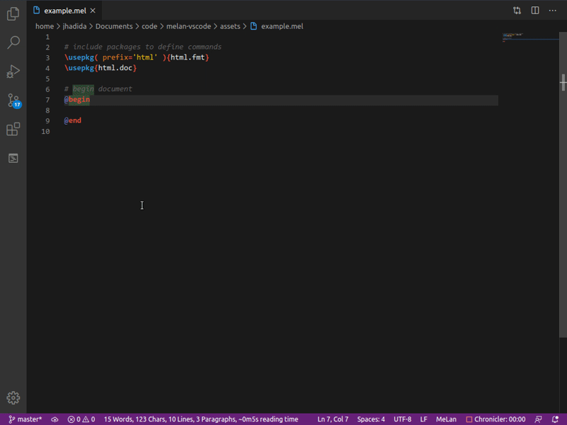

<a href="https://marketplace.visualstudio.com/items?itemName=jhadida.melan"></a>


# VSCode language extension for MeLan

This is a language extension package for VSCode to support the syntax of [MeLan](https://github.com/jhadida/melan), the meta-language with Python backend.



## Known Issues

TextMate grammars are not well suited to describing contiguous sequences of scopes spanning multiple lines, each with their own rules (e.g. `Command > Options > Body`).
For this reason, the matching of commands, option groups, and body contents, are currently implemented with separate rules. 

Hence the following issues:

1. Parentheses directly following a word character (letter, digit or underscore) may be wrongly interpreted as an option group:
```
    a( foo=5 )          # wrongly colored as option group
```
2. Body delimiters (`{} [] <[]>`) directly following a word charater, or a closing parenthesis, may be wrongly colored as well:
```
    a{ not a body }     # wrongly colored as body
    )[ not a body ]     # wrongly colored as body
```

The solution for these issues is to use the tilde character `~`, which Melan replaces with an empty string during compilation:
```
    a~( foo=5 )
    a~{ not a body }
    )~[ not a body ]
```

## Tips

Angular body delimiters `<[ ]>` are intended to contain pre-formatted text (e.g. code samples) with all sorts of crazy syntax.
However, if your code samples contains `]>`, it cannot be escaped, and may therefore be wrongly interpreted as a closing delimiter.

In order to solve this, we had to tweak the grammar rules for angular bodies, which leads to a couple of "_gotchas_":

- Multiline angular bodies must end with `]>` **WITHOUT trailing whitespace** (i.e. `]>⎵` is **NOT** a valid closing delimiter).
- As a result, if your code sample contains `]>`, you can effectively "escape" it simply by inserting a space after it: `]>⎵`.

## Release Notes

### [0.1.0] – 27-Apr-2020

- Initial release
- Support commonly expected syntaxes
- Support embedded JSON with the `define` command
